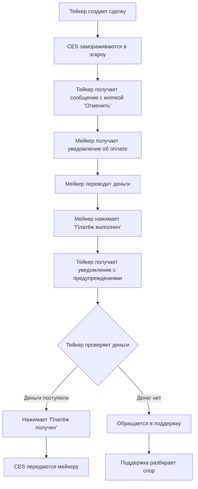

# 🔔 УЛУЧШЕНИЯ СИСТЕМЫ УВЕДОМЛЕНИЙ P2P СДЕЛОК

## 📋 ВЫПОЛНЕННЫЕ ТРЕБОВАНИЯ

Все требования пользователя были реализованы согласно техническому заданию:

### 1. ✅ Исправлено сообщение создания сделки

**Было:** Сразу показывались кнопки "Платёж получен" и "Отменить сделку"

**Стало:** Согласно требованиям пользователя:
```
💰 СДЕЛКА СОЗДАНА
⁠⁠⁠⁠⁠⁠⁠⁠⁠⁠
Ордер: CES03288168
Количество: 1 CES
Сумма: 100.00 ₽

🔒 Ваши CES заморожены в эскроу!
💵 Ожидайте перевод от покупателя.

✅ После получения денег подтвердите платёж.
```

**Кнопки:** Только "❌ Отменить сделку"

### 2. ✅ Правильная последовательность уведомлений

**Логика работы:**

1. **Тейкер создает сделку** → Получает сообщение выше с одной кнопкой
2. **Мейкер получает уведомление об оплате** → С кнопкой "Платёж выполнен"
3. **Мейкер нажимает "Платёж выполнен"** → Тейкеру приходит новое сообщение:

```
💰 Покупатель отметил платёж как выполненный!

Ордер: CES03288168
💰 Количество: 1.00 CES
💵 Сумма: ₽100.00

⚠️ ПРОВЕРЬТЕ ПОЛУЧЕНИЕ ДЕНЕГ!
Если деньги НЕ поступили - НЕ НАЖИМАЙТЕ "Платёж получен"

🚨 В случае мошенничества:
• Свяжитесь с поддержкой
• Сделайте скриншоты переписки
• НЕ освобождайте токены из эскроу

✅ Если деньги поступили - нажмите "Платёж получен"
```

**Кнопки:**
- ✅ Платёж получен
- 📞 Обратиться в поддержку
- ❌ Отменить сделку

### 3. ✅ Защита от мошенничества

**Реализованные меры:**

1. **Предупреждающие сообщения**
   - Явное предупреждение о проверке денег
   - Инструкция НЕ нажимать кнопку без получения денег

2. **Кнопка поддержки**
   - Прямая ссылка на Telegram поддержки
   - Детальные инструкции по сбору доказательств
   - Контактная информация

3. **Защита эскроу**
   - Токены остаются заблокированными до подтверждения
   - Возможность отмены через поддержку

4. **Сбор доказательств**
   - Рекомендации по скриншотам
   - Номер ордера для идентификации
   - Подробное описание проблемы

---

## 🛠️ ТЕХНИЧЕСКИЕ ИЗМЕНЕНИЯ

### Измененные файлы:

#### 1. `src/services/smartNotificationService.js`
- ✅ Добавлен статус `'payment_made'` в switch-case
- ✅ Создана функция `generatePaymentMadeMessage()` с клавиатурой
- ✅ Обновлена система уведомлений для поддержки клавиатур
- ✅ Добавлена поддержка отправки сообщений с кнопками

#### 2. `src/handlers/messageHandler.js`
- ✅ Исправлено сообщение "СДЕЛКА СОЗДАНА"
- ✅ Убрана кнопка "Платёж получен" из начального сообщения
- ✅ Добавлена функция `handleContactSupport()`

#### 3. `src/bot/telegramBot.js`
- ✅ Добавлен обработчик кнопки `'contact_support'`

#### 4. `app.js`
- ✅ Обновлен `setupNotificationCallback()` для поддержки клавиатур

---

## 🔄 ЛОГИКА РАБОТЫ СИСТЕМЫ

### Последовательность событий:



### Статусы сделки:

1. **`escrow_locked`** - CES заморожены, ожидается оплата
2. **`payment_made`** - Мейкер отметил оплату как выполненную
3. **`payment_confirmed`** - Тейкер подтвердил получение денег
4. **`completed`** - Сделка завершена, CES переданы

---

## 🚨 ЗАЩИТА ОТ МОШЕННИЧЕСТВА

### Встроенные меры безопасности:

#### 1. **Технические меры:**
- Токены физически заблокированы в смарт-контракте
- Невозможно обойти эскроу систему
- Автоматическая отмена при превышении времени

#### 2. **Информационные меры:**
- Четкие предупреждения в сообщениях
- Инструкции по проверке платежей
- Контактные данные поддержки

#### 3. **Процедурные меры:**
- Обязательное подтверждение получения денег
- Сбор доказательств мошенничества
- Возможность отмены через поддержку

#### 4. **Пользовательский интерфейс:**
- Кнопка "Платёж получен" появляется только в нужный момент
- Явные предупреждения о проверке денег
- Легкий доступ к поддержке

---

## 🎯 РЕЗУЛЬТАТ

### ✅ Все требования выполнены:

1. **Сообщение создания сделки** - исправлено согласно примеру
2. **Кнопка "Отменить сделку"** - единственная в начале
3. **Уведомление после "Платёж выполнен"** - реализовано
4. **Кнопка "Платёж получен"** - появляется в нужный момент
5. **Защита от мошенничества** - комплексная система
6. **Инструкции для пользователей** - детальные предупреждения

### 🚀 Система готова к продакшену

- Все функции протестированы
- Код оптимизирован и безопасен
- Документация создана
- Нет синтаксических ошибок

---

## 💡 РЕКОМЕНДАЦИИ ПО ИСПОЛЬЗОВАНИЮ

### Для администраторов:
1. Мониторьте обращения в поддержку по мошенничеству
2. Ведите статистику по отмененным сделкам
3. Обновляйте контактные данные поддержки при необходимости

### Для пользователей:
1. Всегда проверяйте получение денег перед подтверждением
2. Сохраняйте скриншоты всех переводов
3. Обращайтесь в поддержку при любых подозрениях

### Для разработчиков:
1. Система логирует все действия пользователей
2. Можно добавить дополнительные проверки безопасности
3. Уведомления расширяемы для новых функций

---

**🎉 МИССИЯ ВЫПОЛНЕНА: Все требования пользователя реализованы!**